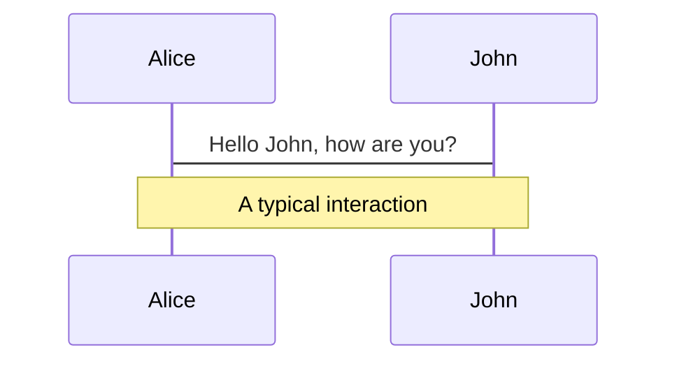
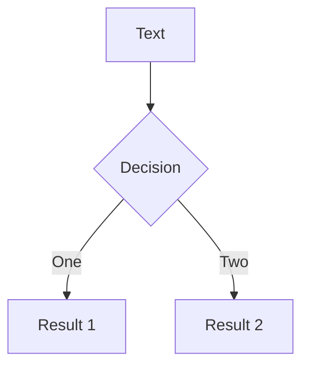

---
# theme id or package name
# Learn more: https://sli.dev/themes/use.html
theme: 'apple-basic'

# what transition to use
transition: 'fade-out'

# title of your slide, will auto infer from the first header if not specified
title: 'Elixir Conf EU 2023 - Lightening Talk - Property Based Testing'

# titleTemplate for the webpage, `%s` will be replaced by the page's title
titleTemplate: '%s - Slidev'

# information for your slides, can be a markdown string
info: false

# enable presenter mode, can be boolean, 'dev' or 'build'
presenter: true

# enabled pdf downloading in SPA build, can also be a custom url
download: true

# filename of the export file
exportFilename: 'slides'

# export options
# use export CLI options in camelCase format
# Learn more: https://sli.dev/guide/exporting.html
export:
  format: 'pdf'
  timeout: 30000
  dark: false
  withClicks: true
  withToc: false
  
# syntax highlighter, can be 'prism' or 'shiki'
highlighter: 'prism'

# show line numbers in code blocks
lineNumbers: true

# enable monaco editor, can be boolean, 'dev' or 'build'
monaco: 'dev'

# download remote assets in local using vite-plugin-remote-assets, can be boolean, 'dev' or 'build'
remoteAssets: false

# controls whether texts in slides are selectable
selectable: true

# enable slide recording, can be boolean, 'dev' or 'build'
record: 'dev'

# force color schema for the slides, can be 'auto', 'light', or 'dark'
colorSchema: 'auto'

# router mode for vue-router, can be "history" or "hash"
routerMode: 'history'

# aspect ratio for the slides
aspectRatio: '16/9'

# real width of the canvas, unit in px
canvasWidth: 980

# used for theme customization, will inject root styles as `--slidev-theme-x` for attribute `x`
themeConfig:
  primary: '#5d8392'

# favicon, can be a local file path or URL
favicon: 'https://cdn.jsdelivr.net/gh/slidevjs/slidev/assets/favicon.png'

# URL of PlantUML server used to render diagrams
plantUmlServer: 'https://www.plantuml.com/plantuml'

# fonts will be auto imported from Google fonts
# Learn more: https://sli.dev/custom/fonts
fonts:
  sans: 'Roboto'
  serif: 'Roboto Slab'
  mono: 'Fira Code'

# default frontmatter applies to all slides
defaults:
  layout: 'default'

# drawing options
# Learn more: https://sli.dev/guide/drawing.html
drawings:
  enabled: true
  persist: false
  presenterOnly: false
  syncAll: true
---

---
layout: image
image: /backgrounds/opening.jpg
---

---
layout: intro
---

# Property-Based Testing<br>with Elixir

ElixirConfEU 2023 - Lisbon/Portugal

<div class="absolute bottom-10">
  <span class="font-700">
    roland@community.com
  </span>
</div>

<!--

Good morning/Ola.

Welcome to the lightening talk on Property-Based Testing with Elixir.

-->

---
layout: image-right
image: /images/focus.png
---

# Lightening Talks

* **En**-Lightening or Lightening **Fast**?
* Let's shoot for **both**!!!
* In 1973 **[Focus]** was asked to perform **Hokus Pokus** on NBC
  Midnight live ...
  * The song is almost 7 mins long
  * The slot they got from NBC was 4:30 mins
  * They did not shorten the song
  * They **just** played it faster. Much **faster** ...
  * And the performance was **en-lightening**
* And no: This is not a picture of me, when I was younger :) ...
* Let's go ...

[Focus]: https://www.youtube.com/watch?v=ill06Ekj6QI

<!--

Lightening talks can be ...

-->

---

# Motivation

* Testing: `input -> function -> output`
  * 3 tests: valid, invalid, edge-case
  * Goal: good code coverage
* In 80% of the cases, **unit-testing** will give you 80% of the value
  and that should be good enough!
* But in some cases you can test ...
  * `all(valid(input)) -> function -> check(property(output))`
  * ... and check that the output is correct
  * ... and find/test the edge-cases 
* These tests are very **valuable** and **low-maintenance**
* Meet **property-based testing**!

<!--

Normally/In general we test ...

-->

---

# Definition, History, Concepts, ...

* `all(valid(input)) -> function -> check(property(output))`
* Property-based testing is "The thing that **QuickCheck** does" :)
  * **Haskell**, 1999, John Hughes 
* Other implementations ...
  * Scala, Clojure, Rust, Go, ...
* Elixir ...
  * PropCheck/PropEr, **StreamData**, ...
* Two main concepts ...
  * **Generators** - Generating Data
  * **Properties** - Checking Properties
* **Shrinking** - If a test fails, find the `smallest` possible
  combination of input values that make the test fail

<!--

Property-based testing ...

-->

---
layout: section
---

# Example

## Pascal's Triangle

<!--

Property-based testing ...

-->

---
layout: image-right
image: /images/pascal.gif
---

# Pascal's Triangle

* Introduction
  * Every row is the sum of the two elements above
  * Creates a **triangular array** of the **binomial coefficients** 
* Properties
  * Every row has one element more than the previous row
  * Every row is a palindrome
  * The sum of all elements in a given row is double the sum of all
    elements in the previous row
  * More ...

<!--

Property-based testing ...

-->

---
layout: image-right
image: /images/palindrome.png
---

# Pascal's Triangle

* Introduction
  * Every row is the sum of the two elements above
  * Creates a triangular array of the binomial coefficients 
* Properties
  * Every row has one element more than the previous row
  * Every row is a **palindrome**
  * The sum of all elements in a given row is double the sum of all
    elements in the previous row
  * More ...

<!--

Property-based testing ...

-->

---
layout: section
---

# Example

## !!! (60 sec) Live Coding !!!

<!--

Property-based testing ...

-->

---
layout: image-right
image: /images/book.jpg
---

# Main/Key Takeaways ...

* Do **not** force using PBT. It (only) works (well) for a subset of
  problem-domains (e.g. math problems, pure functions, ...)
* Do **not** look at it as an alternative for your tradional
  unit-testing, but more as a way to **complement** your unit-testing to
  make it more comprehensive, more complete and easier to maintain
* Buy the book :) ...
* Attend the training :) ...

<!--

Notes ...

-->

---
layout: image-right
image: /images/palindrome.png
---

# Main/Key Takeaways ...

* Do **not** force using PBT. It (only) works (well) for a subset of
  problem-domains (e.g. math problems, pure functions, ...)
* Do **not** look at it as an alternative for your tradional
  unit-testing, but more as a way to **complement** your unit-testing to
  make it more comprehensive, more complete and easier to maintain
* Buy the book :) ...
* Attend the training :) ...
* Sleep well tonight !!!

<!--

Notes ...

-->

---
layout: image
image: /backgrounds/opening.jpg
---

---
layout: section
---

# Appendix - Slidev Demo

---
layout: section
---

# Layouts

---

# Default

* Slide bullet text
* Slide bullet text
* Slide bullet text

---
layout: bullets
---

* Slide bullet text
* Slide bullet text
* Slide bullet text

---
layout: intro
---

# Intro Layout

Presentation subtitle

<div class="absolute bottom-10">
  <span class="font-700">
    Author and Date
  </span>
</div>

---
layout: intro-image
image: 'https://live.staticflickr.com/65535/49768700213_0c23e49354_z.jpg'
---

<div class="absolute top-10">
  <span class="font-700">
    Author and Date
  </span>
</div>

<div class="absolute bottom-10">
  <h1>Intro-Image Layout</h1>
  <p>Presentation subtitle</p>
</div>

---
layout: intro-image-right
image: 'https://live.staticflickr.com/65535/49768700213_0c23e49354_z.jpg'
---

# Intro-Image-Right Layout

## Slide Subtitle

---

---
layout: two-cols
---

# Left

* Slide bullet text
* Slide bullet text
* Slide bullet text

::right::

# Right

* Slide bullet text
* Slide bullet text
* Slide bullet text

---
layout: image-right
image: 'https://live.staticflickr.com/65535/49768700213_0c23e49354_z.jpg'
---

# Image-Right Layout

## Slide Subtitle

* Slide bullet text
* Slide bullet text
* Slide bullet text

---
layout: section
---

# Section Layout

---
layout: statement
---

# Statement Layout

---
layout: fact
---

# Fact Layout
Fact information

---
layout: quote
---

# "Quote Layout"
Attribution

---
layout: 3-images
imageLeft: 'https://live.staticflickr.com/65535/49768700213_0c23e49354_z.jpg'
imageTopRight: 'https://live.staticflickr.com/65535/49768700213_0c23e49354_z.jpg'
imageBottomRight: 'https://live.staticflickr.com/65535/49768700213_0c23e49354_z.jpg'
---

---
layout: image
image: 'https://live.staticflickr.com/65535/49768700213_0c23e49354_z.jpg'
---

---
layout: section
---

# Code Highlighter

---
highlighter: shiki
---

# Code Example

```elixir {5|9-13|all}
defmodule Weather.ApiTest do
  @moduledoc false

  use ExUnit.Case
  use ExVCR.Mock, adapter: ExVCR.Adapter.Hackney

  describe "get_forecast/1" do
    test "success: get weather for (correct) city" do
      use_cassette "api_successful_request" do
        {:ok, forecast} = "Lisbon" |> Weather.Api.get_forecast()
        assert forecast["city"]["name"] == "Lisbon"
        assert forecast["city"]["country"] == "PT"
      end
    end
  end
end

```

---
layout: section
---

# Markdown Syntax

---

# Local image

![working][]

* Slide bullet text
* Slide bullet text
* Slide bullet text
 
![working][]

[working]: /images/working.jpg

---

# Local image tag


* Slide bullet text
* Slide bullet text
* Slide bullet text
 


---

# Local image tag (II)


* Slide bullet text
* Slide bullet text
* Slide bullet text

---

# Presenter Notes

* Slide bullet text
* Slide bullet text
* Slide bullet text

<!--
This is a paragraph.

And this is a bullet list ...

* ???
* ???
* ???
-->

---

# Icons

<mdi-account-circle /> - ??? <br/>
<carbon-badge /> - ??? <br/>
<uim-rocket /> - ??? <br/>
<twemoji-cat-with-tears-of-joy /> - ??? <br/>
<logos-vue /> - ??? <br/>

View more/all [icons][] ... like ...

<mi-circle-add />
<mi-circle-remove />
<mi-circle-check />
<mi-circle-error />
<mi-circle-help />
<mi-circle-information />

[icons]: https://icones.js.org

---

# Diagrams



---

# Diagrams (cont.)



---

# Element Transition

<v-clicks>

* Slide bullet text
* Slide bullet text
* Slide bullet text

</v-clicks>
